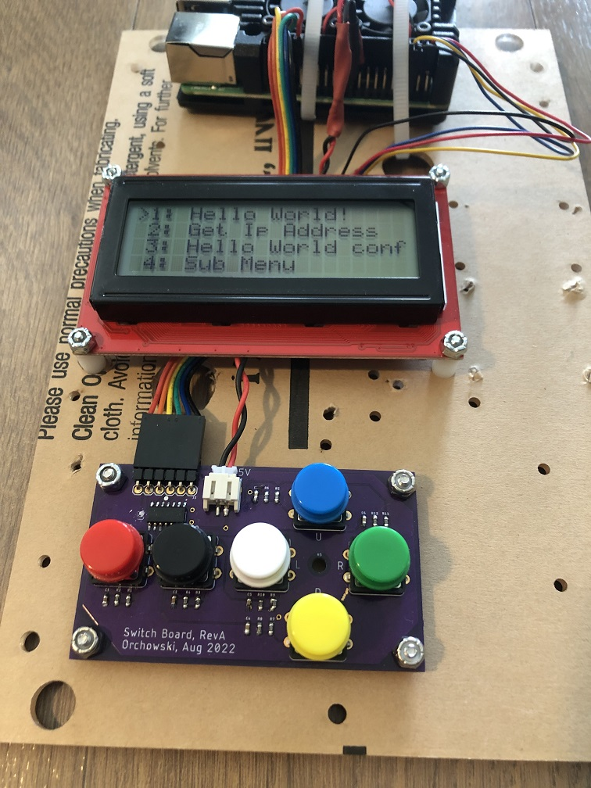

# Table of Contents
1. [Introduction](#introduction)
2. [Structure of a menu system](#structure-of-a-menu-system)
   - [MenuSystem](#menu-system)
   - [Important enumerations and subclasses](#important-enumerations-and-subclasses)
   - [menunodes.json](#menunodes.json)
   - [executors.json](#executors.json)
   - [Menu node types](#menu-node-types)
   - [Display](#display)
   - [MenuAction](#menuaction)
   - [Special Node IDs](#special-node-ids)
   - [Special rules when defining nodes](#special-rules-when-defining-nodes)
3. [Menu System Types](#menu-system-types)
   - [Dependencies](#dependencies)
   - [Terminal Menu](#terminal-menu)
   - [Raspberry Pi Menu](#raspberry-pi-menu)
4. [Executing unit tests](#executing-unit-tests)
5. [Future Improvements](#future-improvements)
   - [Robustness](#robustness)

# Introduction

This is a collection of python classes and scripts for implementing a basic menuing system. Users navigate a collection of options and sub-options. When selected, each option triggers the execution of a script or registered method.

# Structure of a menu system

A basic menu system consists of the following components.

## MenuSystem

[MenuSystem](menu/menusystem.py) is the main class linking the MenuAction and Display modules to the menu structure defined in the json files. This class contains the main event loop responsible for processing menu actions and dispatching these to the appropriate display or execution methods.

Typically there will be a wrapper class instantiating the Display and MenuAction objects to plug in to the MenuSystem object. See [Terminal Menu](#terminal-menu) and [Raspberry Pi Menu](#raspberry-pi-menu). These wrapper classes are also responsible for invoking the "register_method()" method on the MenuSystem object for invoking any desired callbacks on menu actions.

## Important enumerations and subclasses

**Enumeration Values**
- MenuNodeSpecialId
- MenuDestination
- ExecutorNodeType
- MenuNodeType

**Important Subclasses**
- SelectionOption
- ExecutorNode
- MenuNode
- Menus
- Navigator
- Executor

## menunodes.json

[A json file](menuservice/menunodes.json) that defines the set of menu nodes comprising the structure and operation of the menu system.

## executors.json

[A json file](menuservice/executors.json) that defines a set of executors. Executors encapsulate the execution behavior of a menu node. They map an execution type menu node to a script or method to execute.

Most executor nodes will set **destinationOverride** to **postExecuteOutput** in order to display the resulting output of the script/method execution. TODO: make this the default since most will do it this way. **lastSelectOptionMenu** is not common.

## Menu node types

These menu node types define how the menu system will treat operation and handling of a menu node.
- execution
- selection
- output

## Display

The [Display](menu/display/display.py) class defines a basic set of methods that allows the menu system to send output resulting from the processing of menu Actions.

Sub-classes
- [TerminalDisplay](menu/display/terminal.py)
- [BoundedCharacterDisplay](menu/display/bounded.py): restricts output to a defined number of columns and rows. Not meant for instantiation.
   - [BoundedCharacterTerminalDisplay](menu/display/bounded.py)
   - [Sparkfun4x20LCDDisplay](menu/display/sparkfunlcd.py)

## MenuAction

The [MenuAction](menu/action/menuaction.py) class defines a basic set of methods for obtaining user input and converting this to an Action.

- [KeyboardMenuAction](menu/action/keyboardmenuaction.py) - converts keyboard character input to a mapped Action.
- [RPiButtonBoardMenuAction](menu/action/rpibuttonmenuaction.py) - converts raspberry pi GPIO input to a mapped Action.

## Special Node IDs

You are free to define node IDs as necessary, but the following node IDs are treated specially by the menu system.

- **ROOT**: The first node displayed at startup.
- **OUTPUT**: A special menu node for displaying the output of an executed script or method.
- **CONFIRMATION**: A special selection type node that will ask the user to proceed with execution.
- **NO**: An execution node which will go back to the previous selection menu.
- **YES**: An execution node which, when selected, will execute the originally-selected menu option.

## Special rules when defining nodes
1. One and only one **ROOT** node must be defined. The system will fail to start otherwise.
2. Every menu node must have a id and type. 
3. Selection type nodes must have at least one selection option defined.
4. Each selection option must have a displayName field defining the string to output showing that menu option. It must also define a menuNodeId that points to a valid menu node.
5. The menuNodeId pointed to by a selection option must be for a menu node of type "execution".
6. Execution type nodes must have a executorNodeId defined that points to a valid executor node defined in executors.json
7. Menu node IDs cannot be duplicated.
8. Executor node IDs cannot be duplicated.

# Menu System Types

## Dependencies

Before running "python setup.py install", you must execute: `sudo apt install python-dev-is-python3`

Before running the rpi button menu service, you must:
1. `sudo pip install RPi.GPIO`
2. `sudo pip install sparkfun-qwiic-i2c`
3. `sudo pip install sparkfun-qwiic-serlcd`

pip install RPi.GPIO will require Windows build tools: https://visualstudio.microsoft.com/visual-cpp-build-tools/

## Terminal Menu

[This menu system](menuservice/terminalmenu.py) is intended to run on any Windows or Linux system within the confines of a terminal.

Input is expected one character at a time via keyboard.

This system is great for testing the structure and operation of the menu system defined in the executors and menunodes files.

Start via: `python3 terminalmenu.py`

## Raspberry Pi Menu

[This menu system](menuservice/rpimenuservice.py) is intended to run on a Raspberry Pi in conjunction with a SparkFun LCD screen and button input mechanism. While users may choose to run the service from command line for testing purposes, typical use will have the menu system run as a standalone service at startup.

The button's GPIO usage requires this program be run as root.

`sudo python3 rpimenuservice.py`

See the systemd unit file [rpimenu.service](menuservice/rpimenu.service) for running as a standalone service.

My example implementation consists of:
1. A Raspberry Pi 4
2. [a SparkFun 20x4 SerLCD](https://www.sparkfun.com/products/16398) connected to the Pi via I2C (qwiic)
3. [a custom pcb designed in Eagle on which to mount several buttons](./images/pcb.jpg) This board is connected to the Pi's GPIO pins.

Here's [some photos](./images) of the system in action.

# Executing unit tests

From the top-level directory, run the command: `python -m unittest discover -s test`

# Future Improvements

1. Handle control-c for KeyboardMenuAction.
2. Refine setup.py to be compatible with setuptools or run as pip install.
3. Add ability to scroll through output of script or method.
4. Add ability to return to previous menu (outside of confirmation menu "no") via left button press.
5. Ability to start rpimenuservice in virtual environment. sudo appears to give a different set of path values.
6. Allow the menu system to accept complex string input at a menu prompt.

## Robustness
1. Add try/catch around main menusystem::run() loop for graceful shutdown (or continuous operation?)?
2. Consider the necessity of adding a timeout to the queue.get() so that the main run method doesn't block forever if the service should stop.
3. Add better logging or an exception for MenuActions that are not supported by MenuSystem